# 🚀 EIP-7702 Casual Hackathon Project Demo Submission

<!--
Please fill out the information below. This information will be automatically processed.
Do not remove the --- markers or change the field names.
-->

---
## 📋 Project Information (required)

```yaml
project_name: "zkPassSession (AuthDevice7702)"
description: "Hardware-locked session keys for EIP-7702 smart accounts. A hybrid model combining ZK-verified device registration with per-transaction hardware signatures for ultra-cheap and secure transactions."
```

## 👥 Team Information (required)

```yaml
team_members: ["Ham3798"]
```

## 🔍 Additional Information (optional)

```yaml
notes: "Original team name: ezaa. Please note that this submission is primarily a research and design concept; most of the described features are not yet implemented."
```
---

<!-- Do not edit below this line. This section will be automatically generated when your demo submission is processed. -->

## 📖 Project Overview

**zkPassSession (AuthDevice7702)** introduces a hybrid security model for EIP-7702 smart accounts, enabling hardware-locked session keys that function like passkeys across multiple devices, similar to Aptos wallet. This approach achieves both high security and gas efficiency.

## 🏛️ System Design

```mermaid
sequenceDiagram
    participant User
    participant Device
    participant Browser
    participant NoirProver
    participant EOA
    participant DeviceMgr as "DeviceManager<br/>+ SessionDelegate"

    User->>Device: Touch ID (first use)
    Device->>Browser: P-256 pub + sig
    Browser->>NoirProver: prove_register()
    NoirProver-->>Browser: π₀
    Browser->>EOA: registerDevice(π₀, walletSig, devicePub)
    EOA->>DeviceMgr: registerDevice()
    DeviceMgr-->>EOA: device stored

    User->>Device: Touch ID (start session)
    Device->>Browser: P-256 sig r,s
    Browser->>NoirProver: prove_touch()
    NoirProver-->>Browser: π₁
    Browser->>EOA: startSession(π₁, walletSig, sessionPub, TTL)
    EOA->>DeviceMgr: startSession()
    DeviceMgr-->>EOA: session active

    note over User,DeviceMgr: each transaction
    User->>Device: Touch ID
    Device->>Browser: P-256 sig (for auth)
    note over Browser: unwrap AES-encrypted sessionPriv → sign txHash
    Browser->>EOA: execute(data, ecdsaSig)
    EOA->>DeviceMgr: execute(...) using ecrecover
    DeviceMgr-->>EOA: delegatecall forwarded
```



## 🎛️ Multi-Device Permission Matrix

This model allows for granular, device-specific permissions, enhancing security and usability.

```
                 ┌─────────────┐
                 │     EOA     │
                 └─────┬───────┘
                       │
        ┌──────────────┼──────────────┐
        │              │              │
   ┌────▼───┐     ┌────▼───┐     ┌────▼───┐
   │iPhone  │     │MacBook │     │ Yubikey│
   │TouchID │     │TouchID │     │  FIDO2 │
   └────────┘     └────────┘     └────────┘
   Permission:    Permission:    Permission:
   • Amount: $100 • Amount: $1000• Amount: $10K
   • DeFi: ✅     • DeFi: ✅     • Admin: ✅
   • NFT: ❌      • NFT: ✅      • Recovery: ✅
```

## 💻 Repository

The proof-of-concept for this project is implemented in the following repository.

```bash
git clone https://github.com/Ham3798/AuthDevice7702.git
```

## 🚀 Running the Demo UI

Navigate to the `ui` directory, install the necessary packages, and start the application.

```bash
cd ui
npm install
npm run dev
```
The application will be available at `http://localhost:3000`.

## 📝 License
MIT
<!-- Specify your project license -->
